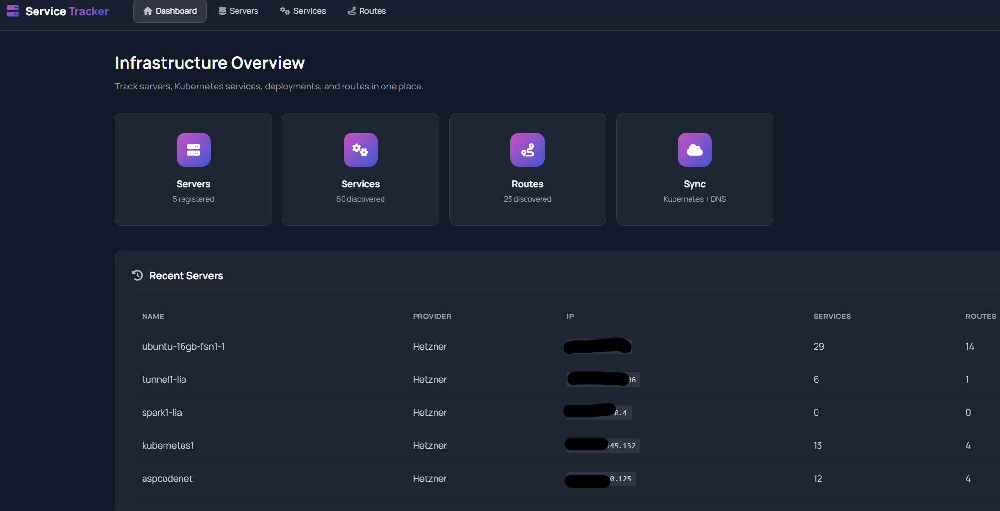
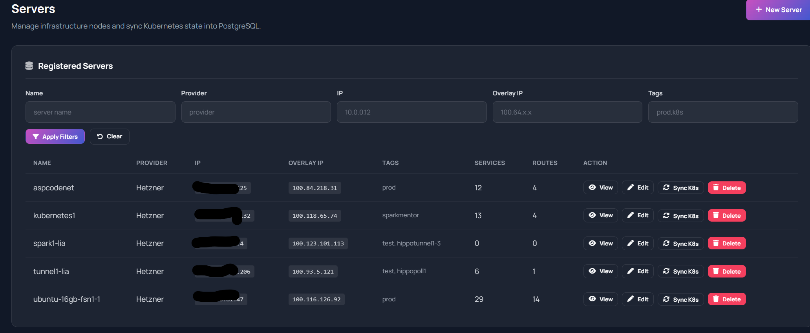
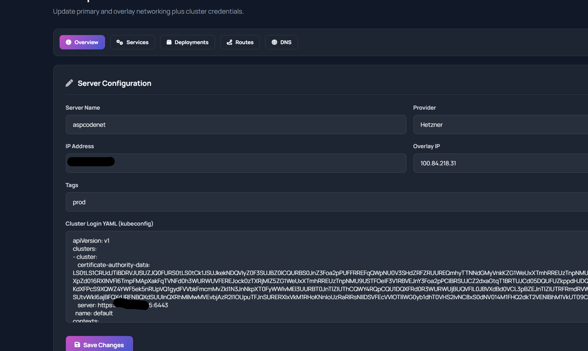

# ServerMentor

ServerMentor is an open-source infrastructure inventory and operations dashboard for teams running servers and Kubernetes clusters.

It gives you one web UI to register machines, store cluster access, sync Kubernetes state into PostgreSQL, and browse services, deployments, routes, and known DNS names discovered from route data.

The current UI branding in the screenshots still says Service Tracker. The repository and documentation use the name ServerMentor.

Released under the MIT License.



## Why ServerMentor

ServerMentor is designed for the common "small but real" infrastructure problem: you have a handful of servers, one or more clusters, route hostnames, deployment metadata, and tribal knowledge spread across shells, kubeconfigs, and notes.

This project pulls that information into a single admin console backed by PostgreSQL.

## Features

- Track servers with provider, primary IP, overlay IP, tags, and stored kubeconfig.
- Sync Kubernetes services, deployments, ingresses, and Gateway API HTTPRoutes into the local database.
- Browse global inventory views for servers, services, and routes.
- Explore each server through dedicated Overview, Services, Deployments, Routes, and DNS tabs.
- Use built-in authentication providers or trust headers from a reverse proxy or access gateway.
- Run locally with an intentionally insecure no-auth mode for development.

## Screenshots

The dashboard gives a quick infrastructure summary and recent server list.


The servers page provides filtering, counts, and direct actions for view, edit, sync, and delete.



Each server also has a dedicated detail view with tabs for synced Kubernetes data and stored cluster access.



## What Gets Synced

When you trigger a sync for a server with a kubeconfig, ServerMentor imports:

- Kubernetes Services
- Deployments associated with those Services
- Ingress hostnames
- Gateway API HTTPRoute hostnames

Those records are stored in PostgreSQL and shown in the UI. The DNS tab is based on known route hostnames stored by the app, not a live vendor-specific DNS API lookup.

## Tech Stack

- Go 1.25
- Gin
- GORM
- PostgreSQL
- Kubernetes client-go

## Quick Start

### Option 1: Local Development Without External Auth

This is the easiest way to run the project locally while developing.

Prerequisites:

- Go 1.25 or newer
- PostgreSQL

1. Create a PostgreSQL database named `servicetracker`.
2. Copy `.env.example` to `.env`.
3. Update the database settings in `.env`.
4. Enable the local development auth bypass:

```env
AUTH_MODE=disabled
ALLOW_INSECURE_NO_AUTH=true
```

5. Start the app:

```bash
go run .
```

6. Open `http://localhost:8080/admin`.

Important: `AUTH_MODE=disabled` is only for local development in trusted environments.

### Option 2: Run Behind `oauth2-proxy`

An example Compose stack is included in `examples/docker-compose.oauth2-proxy.yml`.

It starts:

- PostgreSQL
- ServerMentor from the checked-out source tree
- `oauth2-proxy` configured for GitHub OAuth

Set these environment variables before starting:

```env
OAUTH2_PROXY_CLIENT_ID=github-oauth-app-client-id
OAUTH2_PROXY_CLIENT_SECRET=github-oauth-app-client-secret
OAUTH2_PROXY_COOKIE_SECRET=replace-with-a-32-byte-secret
AUTH_SESSION_SECRET=replace-with-a-long-random-secret
AUTH_ADMIN_EMAILS=admin@example.com
```

Start the stack:

```bash
docker compose -f examples/docker-compose.oauth2-proxy.yml up
```

Then open `http://localhost:4180/admin`.

For more proxy deployment patterns, see `docs/auth-proxy.md`.

## Authentication Modes

ServerMentor supports three broad authentication approaches:

- `AUTH_MODE=disabled` for local development only
- Built-in providers such as GitHub and MentorLogin
- Trusted reverse proxy or gateway headers with `AUTH_MODE=proxy` or `AUTH_PROXY_ENABLED=true`

For proxy-based deployments, the app can trust identity headers such as:

- `X-Forwarded-User`
- `X-Forwarded-Email`
- `X-Forwarded-Groups`

Supported examples are documented in `docs/auth-proxy.md` for:

- Nginx `auth_request`
- Traefik ForwardAuth
- `oauth2-proxy`

## Configuration

Core runtime settings:

| Variable | Purpose |
| --- | --- |
| `DB_HOST` | PostgreSQL host |
| `DB_PORT` | PostgreSQL port |
| `DB_USER` | PostgreSQL username |
| `DB_PASSWORD` | PostgreSQL password |
| `DB_NAME` | PostgreSQL database name |
| `PORT` | HTTP listen port |
| `AUTH_SESSION_SECRET` | Secret used for session cookies |
| `AUTH_ADMIN_EMAILS` | Comma-separated admin allowlist |
| `AUTH_MODE` | Authentication mode, such as `disabled` or `proxy` |

If you enable proxy auth, also review:

- `AUTH_PROXY_TRUSTED_PROXIES`
- `AUTH_PROXY_SUBJECT_HEADERS`
- `AUTH_PROXY_EMAIL_HEADERS`
- `AUTH_PROXY_GROUPS_HEADERS`

The application automatically migrates the database schema on startup.

## Project Layout

| Path | Purpose |
| --- | --- |
| `main.go` | HTTP server, routes, handlers, and page composition |
| `auth.go` | Authentication providers, session handling, and proxy auth |
| `models/` | GORM models for servers, services, deployments, and routes |
| `services/k8s.go` | Kubernetes sync logic |
| `templates/` | HTML templates for the admin UI |
| `static/` | CSS and static assets |
| `examples/` | Example deployment files, including `oauth2-proxy` |
| `docs/` | Additional documentation and screenshots |

## Development Notes

- Server records include an optional kubeconfig stored in the database.
- Sync currently recreates service and route records for a server from the cluster source of truth.
- Deployment matching is based on service selectors and is intentionally pragmatic rather than exhaustive.

## Contributing

Issues and pull requests are welcome.

If you plan to make a larger change, open an issue first so the shape of the change can be discussed before implementation.

## License

This project is licensed under the MIT License. See `LICENSE` for details.